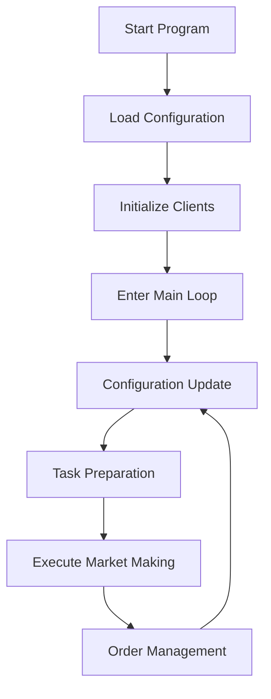
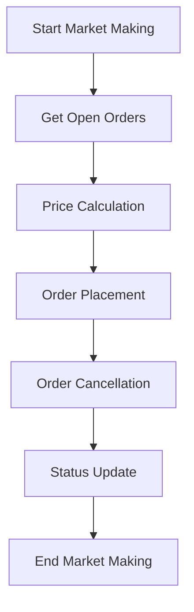

# Follow Maker Algorithm Flow Description

## 1. Algorithm Overview

Follow Maker is a market making algorithm designed to follow price movements of a reference cryptocurrency pair and replicate these movements on a target currency pair. The algorithm provides liquidity to the market by placing orders at different price levels while maintaining price correlation with the reference currency pair.

## 2. Core Features

- **Price Following**: Follows price movements of the reference cryptocurrency pair
- **Multiple Market Making Strategies**: Supports EXACT, PIVOT, TRADE, and FIXED strategies
- **Multi-level Order Placement**: Supports nearest, near, and far three-level order configurations
- **Dynamic Configuration Updates**: Real-time configuration updates via Redis

## 3. Algorithm Flow

### 3.1 Startup Flow

1. **Load Configuration**: Load strategy configuration from Redis
2. **Initialize Clients**: Create trading client and market data client
3. **Enter Main Loop**: Start executing market making tasks



### 3.2 Main Loop Flow

1. **Configuration Update**: Check for configuration updates from Redis every 5 seconds
2. **Task Preparation**: Prepare market making tasks based on configuration
3. **Execute Market Making**: Execute market making operations
4. **Order Management**: Manage order placement and cancellation

### 3.3 Market Making Flow

1. **Get Open Orders**: Get previous open orders
2. **Price Calculation**: Calculate market making prices based on strategy type
3. **Order Placement**: Place new orders based on calculated prices
4. **Order Cancellation**: Cancel previous open orders
5. **Status Update**: Update strategy status to Redis



## 4. Strategy Types

### 4.1 EXACT Strategy

- **Principle**: Strictly follows the price of the reference cryptocurrency pair, maintaining real-time price consistency
- **Flow**:
  1. Get the latest price of the reference currency pair
  2. Use the reference price as the base price for the target currency pair
  3. Calculate buy/sell prices based on spread
  4. Place orders

### 4.2 PIVOT Strategy

- **Principle**: Uses IPO price as initial reference, follows price movements of the reference currency pair
- **Flow**:
  1. Get the latest price of the reference currency pair
  2. Calculate price change rate of the reference currency pair
  3. Apply the change rate to the base price of the target currency pair
  4. Calculate buy/sell prices based on spread
  5. Place orders

### 4.3 TRADE Strategy

- **Principle**: Uses the latest trading price as the base, plus同期 fluctuations of the reference currency pair
- **Flow**:
  1. Get the latest trading price of the target currency pair
  2. Get the latest price of the reference currency pair
  3. Calculate price change rate of the reference currency pair
  4. Apply the change rate to the latest trading price of the target currency pair
  5. Calculate buy/sell prices based on spread
  6. Place orders

### 4.4 FIXED Strategy

- **Principle**: Places orders around a fixed price, regardless of price movements of the reference currency pair
- **Flow**:
  1. Randomly generate trading prices around the fixed price
  2. Calculate buy/sell prices based on spread
  3. Place orders

## 5. Multi-level Order Strategy

### 5.1 Order Levels

- **nearest_end**: Nearest end orders, closest to the current market price
- **near_end**: Near end orders, moderately close to the current market price
- **far_end**: Far end orders, farthest from the current market price

### 5.2 Level Configuration

Each level can be independently configured with the following parameters:
- **order_frequency**: Order frequency (milliseconds)
- **side**: Trading direction (BUY, SELL, BOTH)
- **side_buy**: Buy side strategy configuration
- **side_sell**: Sell side strategy configuration

### 5.3 Order Placement Logic

1. **Price Calculation**: Calculate buy/sell prices based on base price and level spread
2. **Amount Allocation**: Allocate order amounts based on configured amount and quantity
3. **Order Creation**: Create limit orders
4. **Order Placement**: Batch place orders
5. **Order Cancellation**: Cancel previous open orders

## 6. Price Calculation

### 6.1 Base Price Calculation

- **EXACT Strategy**: Uses the latest price of the reference currency pair
- **PIVOT Strategy**: Uses IPO price plus changes from the reference currency pair
- **TRADE Strategy**: Uses the latest trading price of the target currency pair plus changes from the reference currency pair
- **FIXED Strategy**: Randomly generated around the fixed price

### 6.2 Buy/Sell Price Calculation

```python
def _calc_price_by_spread(side, price, spread_type, margin, step):
    if side == 'SELL':
        return price * (1 + margin * 0.0001) if spread_type == 'BPS' else price + margin * step
    return price * (1 - margin * 0.0001) if spread_type == 'BPS' else max(0, price - margin * step)
```

## 7. Risk Control

- **Price Volatility Limit**: Controls price volatility through beta factor
- **Order Quantity Control**: Controls order size based on configured quantity and amount
- **Frequency Control**: Controls order placement frequency based on configured frequency

## 8. Monitoring and Logging

- **Strategy Status**: Stored in Redis with key format `_amstatus_{strategy_id}`
- **Base Price**: Stored in Redis with key format `{project_id}{exchange}{symbol}`
- **Log Records**: Records order placement, cancellation, configuration updates, and errors

## 9. Configuration Example

```json
{
  "api_key": "your_api_key",
  "api_secret": "your_api_secret",
  "exchange": 10011,
  "follow_exchange": 10002,
  "follow_symbol": "SOLUSDT",
  "symbol": "JPMUSDT",
  "maker_type": "PIVOT",
  "ipo_price": 1.0,
  "far_end": {
    "order_frequency": 5000,
    "side_buy": {
      "amount": 100,
      "base_margin": 20,
      "base_type": "BPS",
      "level_margin": 8,
      "level_type": "BPS",
      "quantity": 50,
      "step_size": 1e-06,
      "time_in_force": "GTX",
      "total_amount": 100000
    },
    "side_sell": {
      "amount": 100,
      "base_margin": 20,
      "base_type": "BPS",
      "level_margin": 8,
      "level_type": "BPS",
      "quantity": 50,
      "step_size": 1e-06,
      "time_in_force": "GTX",
      "total_amount": 100000
    }
  },
  "near_end": {...},
  "nearest_end": {...}
}
```

## 10. Performance Optimization

- **Asynchronous Execution**: Uses asyncio for asynchronous task execution
- **Batch Operations**: Batch order placement and cancellation
- **Client Caching**: Caches exchange clients to avoid repeated creation
- **Configuration Updates**: Updates configuration periodically to avoid frequent Redis access

## 11. Summary

The Follow Maker algorithm provides liquidity to the target currency pair while maintaining price correlation by following price movements of the reference cryptocurrency pair. The algorithm supports multiple market making strategies and multi-level order configurations, enabling it to adapt to different market environments and trading needs. Through dynamic configuration updates and real-time monitoring, the system can flexibly adjust strategy parameters to respond to market changes.