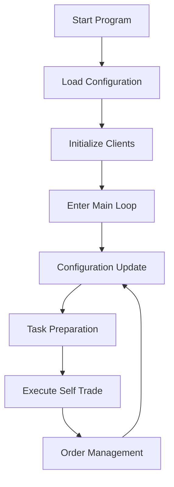
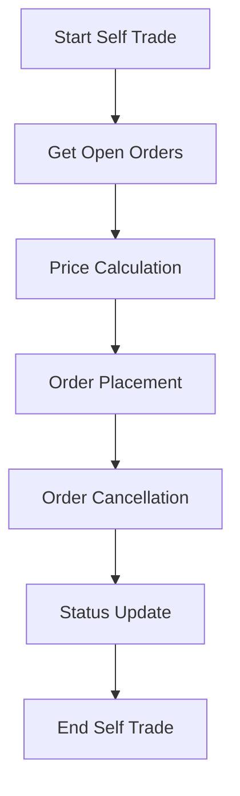

# Self Trade Algorithm Flow Description

## 1. Algorithm Overview

Self Trade is a self-trading algorithm designed to perform self-trading operations between the same trading pair on the same exchange. The algorithm provides liquidity to the market by placing buy and sell orders at different price levels, simulating market activity while maintaining price stability.

## 2. Core Features

- **Self-trading Operations**: Performs self-trading between the same trading pair
- **Multiple Trading Strategies**: Supports FIX, RANDOM, and AMOUNT price strategies
- **Dynamic Configuration Updates**: Real-time configuration updates via Redis
- **Trading Size Control**: Supports multiple trading size configurations

## 3. Algorithm Flow

### 3.1 Startup Flow

1. **Load Configuration**: Load initial strategy configuration from file
2. **Initialize Clients**: Create trading client and market data client
3. **Enter Main Loop**: Start executing self-trading tasks



### 3.2 Main Loop Flow

1. **Configuration Update**: Check for configuration updates from Redis (if Redis key is provided)
2. **Task Preparation**: Prepare self-trading tasks based on configuration
3. **Execute Self Trade**: Execute self-trading operations
4. **Order Management**: Manage order placement and cancellation

### 3.3 Self-trading Flow

1. **Get Open Orders**: Get previous open orders
2. **Price Calculation**: Calculate trading prices based on strategy type
3. **Order Placement**: Place new orders based on calculated prices
4. **Order Cancellation**: Cancel previous open orders
5. **Status Update**: Update strategy status to Redis



## 4. Strategy Types

### 4.1 FIX Strategy

- **Principle**: Places orders around a fixed price
- **Flow**:
  1. Use the configured fixed price
  2. Calculate buy/sell prices based on spread
  3. Place orders

### 4.2 RANDOM Strategy

- **Principle**: Randomly generates trading prices around the fixed price
- **Flow**:
  1. Randomly generate trading prices around the fixed price
  2. Calculate buy/sell prices based on spread
  3. Place orders

### 4.3 AMOUNT Strategy

- **Principle**: Generates trading prices based on amount allocation
- **Flow**:
  1. Generate trading prices based on amount allocation
  2. Calculate buy/sell prices based on spread
  3. Place orders

## 5. Trading Size Configuration

### 5.1 Trading Size Types

- **total_amount**: Total trading amount
- **amount**: Single trading amount
- **quantity**: Trading quantity

### 5.2 Trading Size Calculation

1. **Calculate single amount based on total amount and frequency**
2. **Calculate trading quantity based on amount and price**
3. **Calculate trading amount based on quantity and price**

## 6. Price Calculation

### 6.1 Base Price Calculation

- **FIX Strategy**: Uses the configured fixed price
- **RANDOM Strategy**: Randomly generated around the fixed price
- **AMOUNT Strategy**: Generated based on amount allocation

### 6.2 Buy/Sell Price Calculation

```python
def _calc_price_by_spread(side, price, spread_type, margin, step):
    if side == 'SELL':
        return price * (1 + margin * 0.0001) if spread_type == 'BPS' else price + margin * step
    return price * (1 - margin * 0.0001) if spread_type == 'BPS' else max(0, price - margin * step)
```

## 7. Risk Control

- **Trading Size Limit**: Controls trading size based on configured amount and quantity
- **Frequency Control**: Controls trading frequency based on configured frequency
- **Price Volatility Limit**: Controls price volatility through spread

## 8. Monitoring and Logging

- **Strategy Status**: Stored in Redis with key format `_amstatus_{strategy_id}`
- **Log Records**: Records order placement, cancellation, configuration updates, and errors

## 9. Configuration Example

```json
{
  "api_key": "your_api_key",
  "api_secret": "your_api_secret",
  "exchange": 10011,
  "symbol": "JPMUSDT",
  "self_trade_type": "FIX",
  "fixed_price": 1.0,
  "base_margin": 20,
  "base_type": "BPS",
  "step_size": 1e-06,
  "time_in_force": "GTX",
  "total_amount": 100000,
  "amount": 100,
  "quantity": 50,
  "order_frequency": 5000
}
```

## 10. Performance Optimization

- **Asynchronous Execution**: Uses asyncio for asynchronous task execution
- **Batch Operations**: Batch order placement and cancellation
- **Client Caching**: Caches exchange clients to avoid repeated creation
- **Configuration Updates**: Updates configuration periodically to avoid frequent Redis access

## 11. Summary

The Self Trade algorithm provides liquidity to the market while maintaining price stability by performing self-trading operations between the same trading pair. The algorithm supports multiple price strategies and trading size configurations, enabling it to adapt to different market environments and trading needs. Through dynamic configuration updates and real-time monitoring, the system can flexibly adjust strategy parameters to respond to market changes.